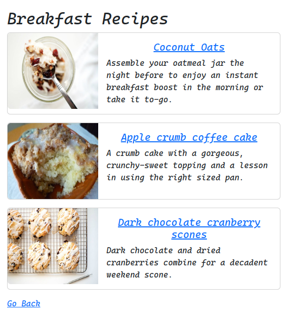

# 🚀 Recipe Management System

### 📋 Table of Contents

- [Key Features](#-key-features)
- [Installation](#-installation)
- [Usage](#-usage)
- [Screenshots](#-screenshots)
- [Contributing](#-contributing)
- [Contact](#-contact)

### 🌟 Key Features

- 🔥 **Permissions** – Permissions are given to user.
- ⚡ **CRUD** – User can Create, Read, Update and Delete recipes based on permissions.

### 📦 Installation

To install this project, follow the steps below:

```
# Clone the repository
git clone https://github.com/Dipen100/Recipe_CRUD.git

# Navigate to the project directory
cd Recipe_CRUD

# Install the necessary dependencies
pip install -r requirements.txt
```
### 🛠️ Usage
Here's how to get started with the project:
```
# create the virtual environment
python3 -m venv .venv

# activate the virtual environment and start the project
source .venv/bin/activate

# run the server
python3 manage.py runserver
```
### 🎨 Screenshots
<div style="display: flex; justify-content: space-around;">
  
  
  
  
  
  
</div>

### 🤝 Contributing
you are welcome to contributions! Here's how you can contribute:

1. Fork the repo and create your branch: git checkout -b (branch-name).
2. Commit your changes: git commit -m 'first commit'.
3. Push to the branch: git push origin (branch-name).
4. Open a pull request.

## 💬 Contact
If any queries contact to dipenthapachhetri@gmail.com

